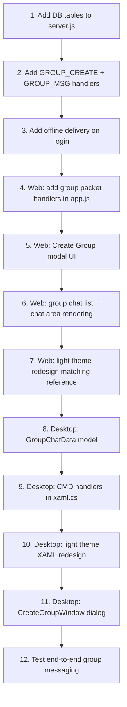

# Whispr — Group Chat Implementation Plan

> **Design Reference**: Light-themed, minimal UI inspired by the mockup — clean white panels, rounded corners, subtle shadows, teal/green accents, no heavy dark backgrounds.

---

## Overview

Add full group chat support to Whispr (Desktop + Web) with a redesigned **light theme UI** matching the reference design. Group messages are **server-relayed** (no true E2EE broadcast yet — planned for v2 with sender keys).

---

## UI Redesign (Matching Reference Image)

### Design Language

| Token | Value | Notes |
|---|---|---|
| Background | `#F7F9F8` | Off-white, soft |
| Sidebar bg | `#FFFFFF` | Clean white |
| Nav Rail bg | `#1A1A1A` | Dark pill icons |
| Accent | `#3FC763` / `#3390EC` | Green online, blue actions |
| Sent bubble | `#1A1A1A` (dark) | High contrast |
| Recv bubble | `#FFFFFF` | White card |
| Text primary | `#1A1A1A` | |
| Text muted | `#9BA3AF` | |
| Border/divider | `#E5E7EB` | Subtle |
| Font | Segoe UI / Inter | Clean sans-serif |

### Layout (3-column)

```
┌──────┬─────────────────────┬──────────────────────────────────┐
│ Nav  │   Messages List     │        Chat Area                 │
│ Rail │                     │                                  │
│ 72px │     320px           │           *                      │
└──────┴─────────────────────┴──────────────────────────────────┘
```

### Nav Rail (Left, 72px, dark rounded)
- App logo (top)
- **Home / Chats** (active)
- **New Group** ➕
- **Files** 🗂️ (placeholder)
- **Contacts** 👥 (placeholder)
- --- (divider)
- **Notifications** 🔔 (placeholder)
- **Settings** ⚙️ (placeholder)
- **My avatar** (bottom)

### Messages List (320px, white)
- **Search bar** — "Search messages..."
- Section header: **"Messages"**
- Chat items showing:
  - Round avatar (or group avatar — stacked initials)
  - Bold name
  - Last message preview (truncated) + `... is typing` indicator
  - Timestamp (right)
  - Read receipt checkmarks (✓ gray / ✓✓ blue)
  - Unread badge (blue dot)

### Chat Area (right panel, white)
- **Header**: Avatar + name + `● Online` / `● N members` + action buttons (pin, edit, share)
- **Messages**: Alternating left (received) / right (sent) bubbles
  - Received: white card, rounded, shadow, sender name shown (for groups)
  - Sent: dark (#1A1A1A) bubble, right-aligned
  - Timestamps below each message
  - Voice message waveform (placeholder)
  - Media grid (image attachments — placeholder)
- **Input bar**: Mic icon + "Write a Message..." placeholder + round send button

---

## Protocol Changes

### New Commands (add to `AMProto`)

| Hex | Name | Direction | Description |
|---|---|---|---|
| `0x10` | `CMD_GROUP_CREATE` | Client→Server | Create new group |
| `0x11` | `CMD_GROUP_CREATE_OK` | Server→Client | Group created with ID |
| `0x12` | `CMD_GROUP_ADD_MEMBER` | Client→Server | Add member to group |
| `0x13` | `CMD_GROUP_MSG` | Client→Server | Send message to group |
| `0x14` | `CMD_GROUP_MSG_RELAY` | Server→Client | Relay group message to members |
| `0x15` | `CMD_GROUP_INFO` | Client→Server | Request group metadata |
| `0x16` | `CMD_GROUP_INFO_OK` | Server→Client | Group metadata response |
| `0x17` | `CMD_GROUP_LEAVE` | Client→Server | Leave group |
| `0x18` | `CMD_GROUP_KICK` | Client→Server | Admin removes member |
| `0x19` | `CMD_GROUP_READ` | Client→Server | Mark group messages as read |

### Packet Payload Schemas

**`CMD_GROUP_CREATE`** (Client → Server)
```json
{
  "name": "Squad 🔥",
  "members": [2, 5, 9]
}
```

**`CMD_GROUP_CREATE_OK`** (Server → Client)
```json
{
  "groupId": 42,
  "name": "Squad 🔥",
  "members": [
    { "userId": 2, "username": "user2" },
    { "userId": 5, "username": "user5" }
  ],
  "createdBy": 1
}
```

**`CMD_GROUP_MSG`** (Client → Server)
```json
{
  "groupId": 42,
  "text": "Hello everyone!"
}
```
> **Note**: Group messages are **not E2EE in v1** — plaintext relay. E2EE (sender keys / MLS) is a v2 feature.

**`CMD_GROUP_MSG_RELAY`** (Server → Client)
```json
{
  "groupId": 42,
  "senderId": 1,
  "senderUsername": "user1",
  "text": "Hello everyone!",
  "messageId": 101,
  "timestamp": 1720000000
}
```

---

## Database Changes (`whispr.db`)

### New Tables

```sql
-- Groups
CREATE TABLE IF NOT EXISTS groups (
  id         INTEGER PRIMARY KEY AUTOINCREMENT,
  name       TEXT NOT NULL,
  created_by INTEGER NOT NULL,
  created_at INTEGER DEFAULT (strftime('%s','now'))
);

-- Group Members
CREATE TABLE IF NOT EXISTS group_members (
  group_id   INTEGER NOT NULL,
  user_id    INTEGER NOT NULL,
  role       TEXT DEFAULT 'member',  -- 'admin' | 'member'
  joined_at  INTEGER DEFAULT (strftime('%s','now')),
  PRIMARY KEY (group_id, user_id),
  FOREIGN KEY (group_id) REFERENCES groups(id),
  FOREIGN KEY (user_id)  REFERENCES users(id)
);

-- Group Messages
CREATE TABLE IF NOT EXISTS group_messages (
  id         INTEGER PRIMARY KEY AUTOINCREMENT,
  group_id   INTEGER NOT NULL,
  sender_id  INTEGER NOT NULL,
  text       TEXT NOT NULL,
  sent_at    INTEGER DEFAULT (strftime('%s','now')),
  FOREIGN KEY (group_id)  REFERENCES groups(id),
  FOREIGN KEY (sender_id) REFERENCES users(id)
);

-- Group Message Read Receipts
CREATE TABLE IF NOT EXISTS group_read (
  group_id   INTEGER NOT NULL,
  user_id    INTEGER NOT NULL,
  last_read  INTEGER DEFAULT 0,
  PRIMARY KEY (group_id, user_id)
);
```

---

## Server Changes (`server.js`)

### New Handlers

```
CMD_GROUP_CREATE
  1. Insert into groups (name, created_by)
  2. Insert creator + all members into group_members
  3. Respond CMD_GROUP_CREATE_OK to creator
  4. Relay CMD_GROUP_INFO_OK to all online members (notify them of new group)

CMD_GROUP_MSG
  1. Validate sender is a member of group_id
  2. Insert into group_messages
  3. For each member in group_members WHERE user_id != senderId:
       - If online → send CMD_GROUP_MSG_RELAY
       - If offline → stored in DB (delivered on next login)

CMD_GROUP_READ
  1. UPDATE group_read SET last_read = messageId WHERE group_id AND user_id

CMD_GROUP_LEAVE
  1. DELETE FROM group_members WHERE group_id AND user_id
  2. Relay system message to remaining members

CMD_GROUP_KICK (admin only)
  1. Verify sender is admin
  2. DELETE FROM group_members WHERE group_id AND user_id = target
  3. Relay system message
```

### On Login — Deliver Pending Group Messages
```js
// After login, fetch missed group messages for all user's groups
SELECT gm.*, g.name as group_name, u.username as sender_username
FROM group_messages gm
JOIN groups g ON g.id = gm.group_id
JOIN group_members mem ON mem.group_id = gm.group_id AND mem.user_id = ?
JOIN users u ON u.id = gm.sender_id
LEFT JOIN group_read gr ON gr.group_id = gm.group_id AND gr.user_id = ?
WHERE gm.id > COALESCE(gr.last_read, 0)
  AND gm.sender_id != ?
ORDER BY gm.sent_at ASC
```

---

## Web Client Changes (`app.js`)

### Data Model
```js
// Add to chat map or use a separate groupChats map
const groupChats = new Map(); // groupId → { name, members[], messages[], unreadCount }
```

### New UI: Create Group Modal
```
[Modal]
  ┌────────────────────────────────┐
  │  Create Group Chat             │
  │                                │
  │  Group Name: [____________]    │
  │                                │
  │  Add Members:                  │
  │  [ Search contacts...     ]    │
  │  ┌──────────────────────────┐  │
  │  │ ✓ user2  ✓ user5        │  │
  │  └──────────────────────────┘  │
  │                                │
  │  [Cancel]        [Create ✓]    │
  └────────────────────────────────┘
```

### Chat List — Group Item Differences
- Avatar: **stacked initials grid** (2–4 member initials in quadrants)
- Name: Group name (bold)
- Preview: `"user2: Last message..."`
- Badge: member count chip `👥 5`

### Chat Header (Group Mode)
- Group avatar (stacked)
- Group name + `● N members online`
- Action buttons: **Add member**, **Group info**, **Leave group**

### Message Bubble (Group Mode — received)
- Show **sender name** above bubble (colored by user hash)
- Same bubble style as DM received

---

## Desktop Client Changes (`MainWindow.xaml.cs`)

### Data Model Addition
```csharp
public class GroupChatData : INotifyPropertyChanged
{
    public uint GroupId       { get; set; }
    public string Name        { get; set; }
    public List<MemberInfo> Members { get; set; } = new();
    public List<MessageData> Messages { get; set; } = new();
    public int UnreadCount    { get; set; }
    public bool IsAdmin       { get; set; }
}

public class MemberInfo
{
    public uint UserId   { get; set; }
    public string Username { get; set; }
}
```

### New XAML Elements
- **"New Group"** button in sidebar header
- **Create Group modal** (overlay panel)
- Group items in `ListChats` — differentiated with group icon badge
- In chat header: member count, manage members button
- Sender name label above received bubbles (group only)

---

## Proposed Files to Modify/Create

### Modified
| File | Changes |
|---|---|
| [`server.js`](file:///c:/Users/jessiepinkman/Desktop/Whispr/amproto/server.js) | Add group CMD handlers, new DB tables, login group delivery |
| [`app.js`](file:///c:/Users/jessiepinkman/Desktop/Whispr/amproto/frontend/app.js) | Group data model, group packet handlers, group UI rendering |
| [`style.css`](file:///c:/Users/jessiepinkman/Desktop/Whispr/amproto/frontend/style.css) | **Full redesign** — light theme matching reference image |
| [`MainWindow.xaml`](file:///c:/Users/jessiepinkman/Desktop/Whispr/WhisprDesktop/MainWindow.xaml) | **Full redesign** — light theme, group UI elements |
| [`MainWindow.xaml.cs`](file:///c:/Users/jessiepinkman/Desktop/Whispr/WhisprDesktop/MainWindow.xaml.cs) | Group data model, group packet handlers, group rendering |
| [`StorageHelper.cs`](file:///c:/Users/jessiepinkman/Desktop/Whispr/WhisprDesktop/StorageHelper.cs) | Persist group chats |

### New
| File | Purpose |
|---|---|
| `AMProto.CMD_GROUP_*` constants | In `AMProto.cs` / `amproto.js` |
| `GroupChatData.cs` | Desktop group model |
| `CreateGroupWindow.xaml` + `.cs` | Desktop "create group" dialog |

---

## Open Questions

> [!IMPORTANT]
> **E2EE for groups** — v1 will be **plaintext** group messages (server reads content). True E2EE requires **Sender Keys** (Signal protocol) or **MLS (RFC 9420)**. Implement in v2?

> [!NOTE]
> **Group admin controls** — Who can add/remove members? Only the creator (admin) or anyone? Plan: creator = admin by default. Admins can promote others.

> [!NOTE]
> **Max group size** — Recommended cap at **256 members** for v1 (same as Telegram basic groups).

> [!NOTE]
> **Group avatars** — Auto-generated stacked initials grid (no custom photo upload for now).

---

## Implementation Order



---

## Milestones

| # | Milestone | Scope |
|---|---|---|
| **M1** | Server + DB | Group tables, CMD handlers, delivery |
| **M2** | Web group messaging | Packets + basic group chat UI |
| **M3** | Web light theme redesign | Full UI overhaul matching reference |
| **M4** | Desktop group messaging | Data model + packet handlers |
| **M5** | Desktop light theme redesign | Full XAML overhaul |
| **M6** | Group admin features | Add/remove/kick members, group info |
| **M7** | Polish + testing | End-to-end flow, edge cases |
